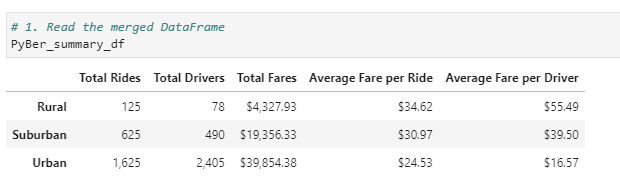
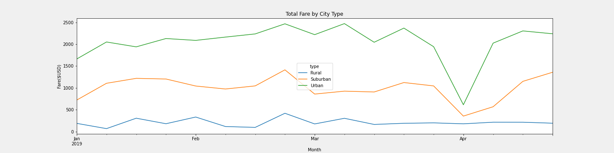

# PyBer_Analysis

## Overview of the analysis: 
The purpose of this project is to analyze the performance of ride-sharing data for Urban, Suburban and Rural city types, and compare how they perform relative to one another.

## Results: 

Not surprisingly, ride-sharing in Urban areas is the category that yields the largest volume of rides and consequently the highest amount of total shares among all city types.
The higher rates per Ride and per Driver are found in Rural areas. Due to low ride volume in rural areas, higher fares are put in place to compensate for the lack of demand as well as an incentive to attract drivers to work in these regions.
The Suburban area falls in the middle compared to Urban and Rural areas with a more balanced fare vs. volume. 

## Summary: 

Based on the results, provide three business recommendations to the CEO for addressing any disparities among the city types.
